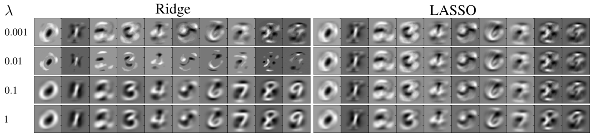
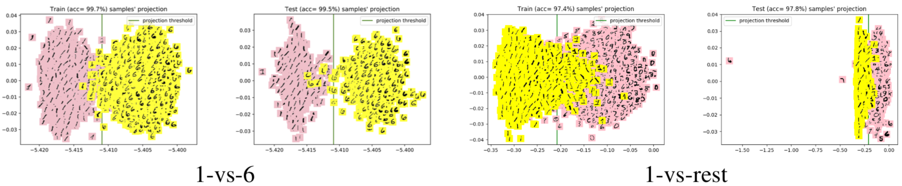
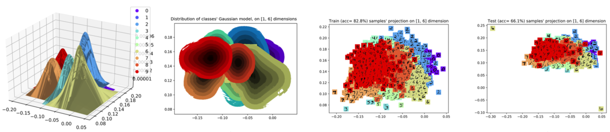
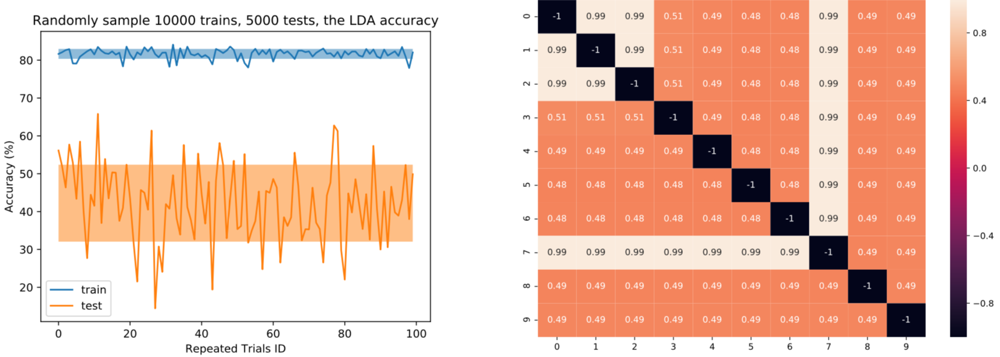
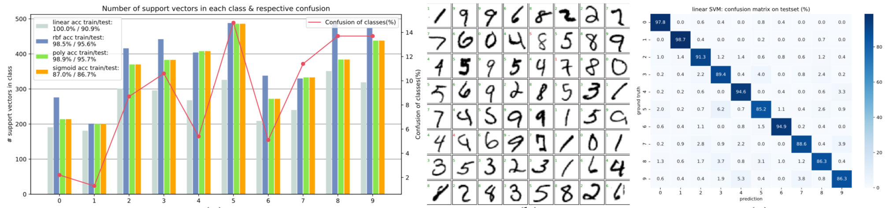
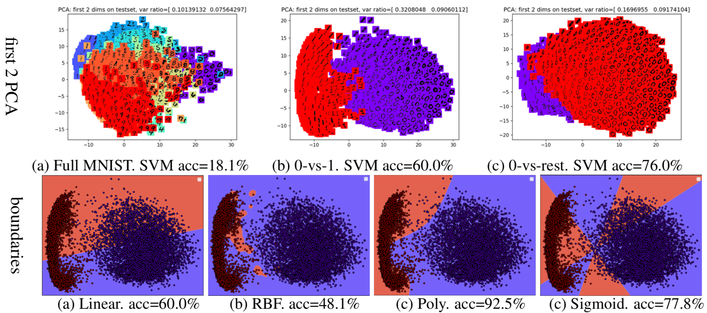

# Logistic regression & LDA from scratch
Codes for SJTU CS385 homework based on MNIST dataset.

## Usage

### Arguments about loading dataset
+ `-sub`: load a subset, still 10-category
+ `--traintest 10000 5000`: 10000, 5000 images respectively in trainset and testset
+ `-1vsr`: load one-vs-rest, binary classes
+ `--loadone 1`: 1-vs-rest
+ `-1vs1`: load one-vs-one, binary classes
+ `--loadtwo 3 5`: 3-vs-5
+ else: load full dataset

### Logistic regression examples

+ `python logistic.py --loss LASSO  -lam 0.01`: logistic regression using intercept term, full dataset (10-class cross entropy), LASSO loss with regularizatation penalty lambda=0.01.
+ `python logistic.py --kernel RBF -1vs1 --loadtwo 0 1`: logistic regression using RBF kernel, binary 0&1 dataset, RBF kernel. On the first run krenel matrix will be precomputed and saved for more runs.

Weights are plotted.

### LDA examples

+ `python LDA.py --trainset 10000 5000`: LDA on 10-categories, load 10000 train images and 5000 test images.
+ `python LDA.py -1vsr --loadone 1`: LDA on binary digits 1-vs-rest.

Threshold for binary classification, bivariate Gaussian distributions and projected samples for multi-classification are plotted. Repeated trials shows LDA's sensitivity on datasets.

### SVM examples

+ `python SVM.py --kernel poly`: SVM with polynomial kernel, on full dataset.
+ Or PCA before SVM. See codes for details.
Confusion matrix, support vectors and decision boundary are plotted.

